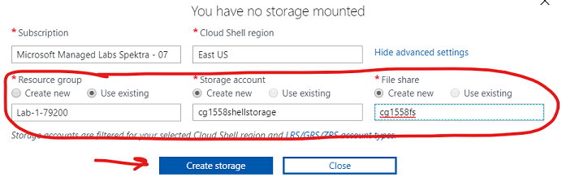

# Lab 1 - Migrate On-Premises Data Servers To Azure

## Lab Goals

The goals of this lab is to get you familiar with the Azure environment, portal and command line.  Everything you can do in the Azure Portal can also be done through a command line and scripting.  In this lab, you will setup and configure services and run migations for the on-premises data stores to Azure

### Learning Objectives
      - Use the Azure Portal to create resources
      - Use the Azure Cloud Shell to create resources
      - Migrate a Linux Mongo DB to Azure Cosmos DB 
      - Migrate a SQL Server 2017 DB to Azure SQL Database

## Setup Environment
You will need a few things in your environment setup for this lab:

- A SQL Server VM that will act as your on-premise SQL instance that you will migrate to Azure SQL DB
  -	A SQL Server VM has been pre-provisioned for this exercise
- An Azure SQL Database Instance.  This is the SQL PaaS service you will migrate the on-premise server to.
  - You will create this as part of the lab
- A Mongo DB that you will migrate data from to Cosmos DB
  - A public Mongo DB will be made available to you to access remotely
- An Azure Cosmos DB MongoDB instance
  - You will create this as part of the lab
- The Microsoft Data Migration Assistant 
  - This has been pre-provisioned on the source SQL VM
- An Azure Database Migration Service
  - An Azure Database Migration Service has been pre-provisioned for this exercise 


### Setup 0 - Create a unique prefix

In many cases you need to create a resource that has a unique name.  The easiest way to do this is to create a prefix that you can append to the front of the standard resource names.    As an example, Bill Smith needs a unique prefix so he decided to use his name and the first three digits of his phone number: his prefix is 'BS336'.  Any resources that need to be unique he can now put this in front of the standard name and it should be unique.  

One thing to consider is that some resources have a limit to how many characters are in a name.  So, keeping your prefix to under 6 characters.  Come up with a prefix you can use for all the labs.

**IMPORTANT: Whenever you see (prefix) in the labs, preplace that with the prefix you come up with.**


### Setup 1 - Verify On-premises SQL VM

Open your email that contains your assigned credentials and keep the browser page open for future reference

1. Login to the Azure Portal http://portal.azure.com using your assigned credentials from your email
2. From the Azure Portal, select `Virtual Machines` from the left-pane menu 
3. Verify the presence of the VM named 'OnPremSQL' and its status is 'running'.  If it's not running, start it from the top menu
4. This is the SQL VM you will use as the source database for the migration


### Setup 2 - Verify Azure Database Migration Service

1. From the Azure Portal, select `Resource Groups` from the left-pane menu then select the resource group named 'Lab-1-xxxxx'
2. Verify the presence of the Azure Database Migration Service
3. Ensure the Migration Service is started by checking its status and starting the service from the top menu as needed
3. This migration service instance will be used when we migrate the on-premises SQL database to Azure

### Setup 3 - Create an Azure Cosmos DB account with Cloud Shell

Up until now you have used the Azure Web Portal.  In this exercise, you will create an Azure Cosmos DB account using the Azure Command Line Interface (CLI) in the Azure Cloud Shell

The Azure Cloud Shell is a command shell that runs in your browser; it creates compute in the back end and a storage account.  You can run either PowerShell or Bash; for these exercises you will use Bash

1. Open the Azure portal
2. Select the `>_` button in the top toolbar 
3. Select `Bash` on the Welcome Screen 
4. Select `Show advanced settings` 
5. Create a new storage account and file share in your resource group.  Use your (prefix) in the name 
   1. Use your existing resource group named 'Lab-1-xxxxx'
6. Select `Create Storage`
7. Wait for the shell to start
8. Make sure you are in  `Bash` from the upper-left dropdown of the Cloud Shell window
9. Create 3 variables by typing the following in the shell and press enter after each line:

```language-bash
RESOURCE_GROUP_COSMOS='<your resource group named 'Lab-1-xxxxx'>'
LOCATION_COSMOS='eastus'
ACCOUNT_NAME_COSMOS='(prefix)migrationcosmos'
```
5. Copy the command below and execute it (you can paste in command window with a  right click).  This will create the Azure Cosmos DB Account using the Azure CLI (az commands)

```language-bash
az cosmosdb create --resource-group $RESOURCE_GROUP_COSMOS --name $ACCOUNT_NAME_COSMOS --kind MongoDB --locations regionName=$LOCATION_COSMOS
```

This will take several minutes to complete. When it is finished (you'll see JSON indicating it's done), go into the portal and select `Resource Groups` from the left-pane menu.  Select the 'Lab-1-xxxx' resource group to see your Cosmos DB account

While you wait for your Cosmos DB instance to spin up you can move on to the creation of the Azure SQL Database instance


### Setup 4 - Create the Azure SQL Database Instance

You will now create an Azure SQL Database - this is the target PaaS database for your SQL migration

1. Select the `Create a resource + sign` button in the top-left of the Azure portal
2. Type 'SQL Database' in the search box and press enter
3. Select SQL Database 
4. Select `Create`
5. From the Basics tab in the menu
   1. Resource Group: Set to the 'Lab-1-xxxxx' resource group
   2. Database Name: (prefix)SQLDB
   3. Server - Select `Create New` on the Database detail section
      1. Server Name: (prefix)sqlserver
      2. Server Admin: migrateadmin
      3. Password: AzureMigrateTraining2019# 
      4. Location: Use 'East US'
      5. Select `OK` on the New Server pane
   4. Select the `Networking` tab on the top menu
      1. Select `Public endpoint` on the Connectivity method radio button
      2. Select `Yes` for both Firewall options (allow Azure services and add current IP)
   5. Select `Review + Create`
   6. Select `Create` once validation is complete

This will take a couple of minutes to complete.  Once finished, all of your setup is completed for Lab Exercises!


### Exercise 1  -  Assess the source database and migrate it to Azure 

In this lab you will migrate the on premises SQL Server to an instance of SQL Azure DB using the [Database Migration Tool](https://www.microsoft.com/en-us/download/details.aspx?id=53595)

#### Finish the SQL Server On-Premises Configuration

1. From the portal, select `Resource groups` and then select the 'Lab-1-xxxxx' resource group
2. Select the 'OnPremSQL' virtual machine
4. Select `Connect` from the top menu, and then select `Download RDP file` 
   1. When prompted on the Remote Desktop Connection, check the box to not be asked again and then select `Connect`
   2. Login with user: '.\migrateadmin' and password: AzureMigrateTraining2019#
   3. When prompted on the Remote Desktop Connection, check the box to not be asked again and then select `Yes`
5. Update IE Security
   1. If not already showing, select the 'Windows' key and type 'Server Manager' to go into the server manager 
   2. Select `Local Server` from the left-pane menu
   2. Select `IE Enhanced Security Configuration` on the right pane 
   3. Set to 'off' for Administrator if it isn't already set 
   4. Close the Server Manager
6. Verify the TailWindInventory DB is installed. This is the database we will migrate to Azure
   1. From the Windows start menu, type 'SQL Server Management'
   2. Launch the SQL Server Management Studio and connect to the local SQL instance. Use Windows Authentication
   3. You should see the TailwindInventory DB installed

You are now all set to migrate the SQL Database using the Data Migration Assistant

#### Assessment
First you need to do a migration assessment to ensure the database has no issues

1. Open the Data Migration Assistant from the desktop icon
2. Create a new project
      - Project Type: `Assessment`
      - Project Name: `tailwind`
      - Source server type: `SQL server`
      - Target server type: `Azure SQL Database`
1. Select `Create`
2. Check `Check database compatibility`
3. Check `Check feature parity`
4. Select `Next`
5. Enter 'localhost' for server name and Windows authentication
6. UN-Check the Encrypt Connection Box
7. Select the `TailwindInventory` database, select `Add`
8. Select `Start Assessment`
9. You will see a report on compatibility issues, and in a production environment you would now have a list of possible incompatibilities that would have to be addressed.

#### Schema Migration 

Now that you know the database can be migrated, you will use the Migration tool to migrate JUST the schema information to the Azure SQL Database.  You will use the more robust Azure Database Migration Service for the data

1. In the Data Migration Assistant create a new project

      - Project Type: `Migration`
      - Project Name: `tailwind`
      - Source server type: `SQL server`
      - Target server type: `Azure SQL Database`
      - Migration Scope: `Schema Only`

1. Select `Create`
2. Source Server: localhost
3. Authentication type: Windows
4. UN-Check the Encrypt Connection box
5. Select `Connect`
6. Select the `TailwindInventory` database, select `Add`
7. Target Server:  This will be the Azure SQL Server Instance you created.  
   1. In the Azure Portal, select `Resource groups` from the left-pane menu and select your resource group
   2. Find the SQL Server Instance you created.  It will be resource type of SQL Server
   3. Copy the `Server name` on the right hand side of the overview page
   4. Paste that full name into the target server name of the wizard
8. Choose SQL Server Authentication
9. User: migrateadmin
10. Password: AzureMigrateTraining2019#
11. Select `Connect`
12. Choose your database and select `next`
13. Select all tables and select `Generate SQL script`
14. Once the script is generated, you may review it
15. Select `Deploy Schema`
16. You now have your schema successfully migrated to Azure SQL DB

#### Data Migration

Now that you have the schema migrated, you now need to move the data.  You will use the Azure Data Migration Service for this as it is much more robust option and can migrate the data with very minimal downtime.

In the beginning of this lab, you were directed to ensure the Azure Database Migration Service was running.  Starting this service can take time, and you might see a message the service is unavailable for migration.  You can wait for it to complete or you can jump ahead to the CosmosDB migration and then come back to this section.

1. In the Azure Portal, select `Resource groups` from the left-pane menu and then select the 'Lab-1-xxxxx' resource group
2. Select the 'Azure Database Migration Service' resource
4. Select on `Create new migration project`
5. Project name: `tailwind`
6. Source server type: `SQL Server`
7. Target server type: `Azure SQL Database `
8. Type of activity: `Offline data migration`
10. Select `Create and run activity`

##### Migration Wizard

1. Source Detail
   1. Source SQL Server Instance Name: The IP Address of your SQL Server VM (you can open the portal in a new tab, click on your VM and get the IP)
   2. Authentication type: `SQL Authentication`
   3. User: migrateadmin
   4. Password: AzureMigrateTraining2019#
   5. Uncheck the encrypt connection box
2. Select Target
   1. Full name of the Azure SQL instance
   2. Authentication type: SQL Authentication
   3. User: migrateadmin
   4. Password: AzureMigrateTraining2019#
   5. Uncheck the encrypt connection box
3. Select `Save`
4. Select `TailwindInventory` database from the source
5. Select your database as the `Target Database`
6. Select `Save`
6. Select all tables and select `Save`
7. Set `Activity name` to a name of your choice
8. In `Validation option` select 'Don't Validate the Database'
8. Select `Run migration`

**Congratulations!**  You have successfully migrated from the VM instance of SQL to Azure SQL DB!  You can check to see the data is there by using the portal based query tool

By default Azure SQL Databases reject all traffic to them.  You were able to run the Azure Database Migration tool because you checked the box to allow other Azure services to connect to it.  In order to connect to it via other tools, you need to open an exception for your IP address through the firewall

##### Modify SQL Firewall

1. Select  your resource group
2. Select your Azure SQL Server Instance
3. From `Overview`, select `Firewalls and virtual networks` from the left-pane menu
4. If you don't see your client IP address listed, select `+ Add client IP` from the top menu
5. Ensure `Allow azure services and resources to access this server` is 'ON'
5. Select `Save`

##### Check your data in SQL

1. From your Azure SQL DB database, select `Query Editor` on the left-hand menu pane
2. Login as user: migrateadmin, Password: AzureMigrateTraining2019#
3. Expand tables - you should see all your tables
4. Run - 'select * from inventory' and you should see all your inventory data

### Exercise 2 - Migrate On-Premises MongoDB to Azure Cosmos DB

The next step is to get the product database migrated to Azure.  Here you are moving an on-premises MongoDB to Azure Cosmos DB using native MongoDB commands

#### Connect to the MongoDB Linux VM

Thre is a shared Linux VM hosting the on-premises MongoDB product database.  You will connect remotely to this server in order to get a dump of data to put into the Cosmos DB.   T

You will do this from the Azure Bash Shell

1. Launch a new Azure Command Shell.  You can either:
   1. Select the shell icon from the top of the Azure Portal
   
2. Download the MongoDB client tools (you can paste into the shell with a right click)

   ```bash
   wget https://repo.mongodb.org/apt/ubuntu/dists/xenial/mongodb-org/4.0/multiverse/binary-amd64/mongodb-org-tools_4.0.11_amd64.deb
   ```

3.  Unpack the downloaded zip file 

   ```
   dpkg-deb -R mongodb-org-tools_4.0.11_amd64.deb ~/mongotools
   ```

4. Set the path to include the tools  

   ```
   export PATH=$PATH:~/mongotools/usr/bin
   ```

5. You now have the MongoDB client tools available to you

#### Export the MongoDB Data

1. Dump the data from the remote MongoDB with the following Command

   1. ```bash
      mongodump --host 52.175.230.38 --username=labuser --password=AzureMigrateTraining2019# --db=tailwind --authenticationDatabase=tailwind
      ```

3. Check to see that you successfully dumped the data

   1. Check that the directory has a dump and tailwind directory that contains the .bson and metadata files.  Run the following Bash commands 

#### Check the Cosmos DB provisioning

Now that you have a copy of the data locally, you can use the mongorestore command to load that data into our Cosmos DB instance you created.

First check to make sure the Cosmos DB instance was created successfully

1. From the left-pane menu, select `Resource groups` and select your resource group
2. Select the resource of type Azure Cosmos DB account
3. Select `Data Explorer` on the left-pane menu
4. Notice 'Collections' is empty - this is OK.  It shows you have a CosmoDB instance and after you restore the database, it will have the product data


#### Restore the Data to our Cosmos DB

1. You will create a few environment variables to store Cosmos DB information for our restore command
2. You will need the Cosmos DB username and password
   1. Navigate to the Cosmos DB account in the Azure portal
   2. Select `Connection String` on the left-pane menu
   3. The username and password for you Cosmos DB instance can be copied from here
3. Go back to the Azure shell 
4. Create the following environment variables in that shell.  Recommend pasting these completed Bash commands into a Notepad file for later reference

```language-bash
COSMOS_DB_NAME='<Host name from connection string properties>'
COSMOS_USER='<username from connection string properties>'
COSMOS_PWD='<primary password from connection string properties>'
```
   
5. Make sure you are still in the /dump/tailwind directory still
6. Copy and paste this command to run a mongo restore:

```language-bash
mongorestore \
    --host $COSMOS_DB_NAME:10255 \
    -u $COSMOS_USER \
    -p $COSMOS_PWD \
    --ssl \
    --sslAllowInvalidCertificates \
    inventory.bson \
    --db tailwind \
    --collection inventory
```

8. Go into your Azure Cosmos DB account and select `Data Explorer`
9. Select the `refresh` button next to Collections if you don't see the tailwind collection
10. Select the `tailwind` database
11. Expand the `tailwind` node, expand the `inventory` node, and select `Documents`
12. You should see the inventory item documents are now in Cosmos DB


**Congratulations!**   You have now successfully moved both a SQL Server Database and a Mongo DB database to the Azure cloud!  Next you will migrate the applications, and then setup a DevOps pipeline for automating its deployment

## Learn More/Resources

* [Create an Azure Cosmos DB database built to scale](https://docs.microsoft.com/learn/modules/create-cosmos-db-for-scale/?WT.mc_id=msignitethetour-github-mig20)
* [Work with NoSQL data in Azure Cosmos DB](https://docs.microsoft.com/learn/paths/work-with-nosql-data-in-azure-cosmos-db/?WT.mc_id=msignitethetour-github-mig20)
* [Work with relational data in Azure](https://docs.microsoft.com/learn/paths/work-with-relational-data-in-azure?WT.mc_id=msignitethetour-github-mig20)
* [Secure your cloud data](https://docs.microsoft.com/learn/paths/secure-your-cloud-data?WT.mc_id=msignitethetour-github-mig20)
* [Azure migration resources](https://azure.microsoft.com/migration?WT.mc_id=msignitethetour-github-mig20)
* [Microoft Data Migration Assistant](https://docs.microsoft.com/sql/dma/dma-overview?WT.mc_id=msignitethetour-github-mig20)
* [Azure total cost of ownership calculator](https://azure.microsoft.com/pricing/tco/calculator?WT.mc_id=msignitethetour-github-mig20)
* [Microsoft Learn](https://docs.microsoft.com/learn?WT.mc_id=msignitethetour-github-mig20)


