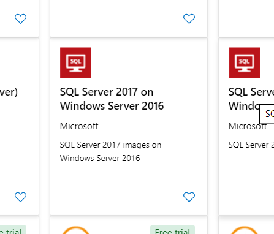

# Lab 1 - Moving Your On-Premises Data Servers To Azure

## Lab Goals

The goals of this lab is to get you familiar with the Azure environment, portal and command line.  Everything you can do in the Azure Portal can also be done through a command line and scripting.  We will expose you to both methods of creating resources in Azure.  In this lab you will:

- Experience Creating a Virtual Machine
- Use the Azure Cloud Shell to create resources
- Migrate a Linux Mongo DB to Azure Cosmos DB 
- Migrate a SQL Server 2017 DB to Azure SQL Database

## Setup Environment
You will need a few things in your environment setup for this lab.

- A SQL Server VM that will act as our on-premise SQL instance that we will migrate to Azure SQL DB
  -	You will create this as part of the lab exercise
- An Azure SQL Database Instance.  This is the SQL PaaS service you will migrate the on-premise server to.
  - You will create this as part of the lab

- A Mongo DB that you will migrate data from to Cosmos DB
  - A public Mongo DB will be made available to you to access remotely.
- An Azure Cosmos DB instance
  - You will create this as part of the lab
- The Microsoft Data Migration Assistant 
  - You will install this as part of the SQL VM creation
- An Azure Database Migration Service
  - You will create this as part of the setup 


### Setup 0 - Create a unique prefix

In many cases you need to create a resource that has a unique name.  The easiest way to do this is to create a prefix that you can append to the front of the standard resource names.    As an exmple, Bill needs a unique prefix so he decided to use his name and the last four digits of his phone number.  So, his prefix is 'Bill3367'.  Any resources that need to be unique he can now put this in front of the standard name and it should be unique.  Come up with a prefix you can use for all the labs.

### Setup 1 - Create SQL VM

1. Login to the Azure Portal http://portal.azure.com

2. Press the create new resource button in the upper left toolbar

   

3. Type 'SQL Server in the search box' - Press Enter

4. Pick 'SQL Server 2017 on Windows Server 2016'

   

5. Press Create

6. Set the following Basic Parameters

   1. Resource Group: Use the Resource Group you were assigned
   2. VM Name: '<prefix>OnPremSQL'
   3. Region: 'East US 2'
   4. Change Size to: D2 v3
   5. Username: 'migrateadmin'
   6. Password: 'AzureMigrateTraining2019#'
   7. Inbound Port Rules
      1. Allows Selected Ports
      2. RDP

7. Press the 'SQL Server settings' on the top toolbar

   1. SQL Connectivity: Pubilc
   2. SQL Authentication: Enable

8. Press 'Review and Create'

   1. If you get a validation failed, press 'previous' then 'Review and Create' again.  This should clear the error.

9. Press Create

Your SQL VM is now provisioning.  It will take a few minutes to provision, so we will provision some other resources while that is going on.

### Setup 2 - Database Migration Service

In this exercise we will create an instance of the Azure Database Migration Service.  This service allows you to automat the migration of data from on premise environments to Azure.

1. In the Azure Portal click the add new resource button
2. Type 'Azure Database Migration' in the search bar
3. Select the 'Azure Database Migration Service'
4. Press 'Create'
5. Enter Parameters
   1. Service Name: '<prefix>MigrationService'
   2. Resource Group: Your assigned Resource Group
   3. Location: East US 2
   4. Virtual Network ->  <resource group>-vnet/default
6. Pricing Tier: Standard 1v core
7. Press Create

The Database Migration Service is now being deployed to your resource group.   While this is provisioning we will continue to the next resources we will need.


### Setup 3 - Create an Azure Cosmos DB account with Cloud Shell

Up until now we have used the Azure Web Portal to create needed resources in our environment.  In this exercise we will show how to create a new Azure Cosmos DB account using the Azure Command Line Interface (CLI) and the Cloud Shell.

The Azure Cloud Shell is a shell environment that runs right in your browser.  It will spin up compute in the back end for you and create a storage account.  You can run either a PowerShell or Bash environment.  For these excerizes we will use Bash

Follow these steps:

1. Open up the Azure portal
1. Click on the `>_` button in the toolbar, and wait for the Cloud Shell to initialize (it will take a few seconds).

1. Select `bash` from the dropdown of the Cloud Shell window.

1. First off create 3 Bash variables by typing the following in the shell and press enter:
  * Resource Group Name - Make sure to set this to YOUR resource group name
  * Region to host the Azure Cosmos DB instance
  * The account name - This MUST be unique.  Create a prefix that would be unique to your.  Possibly your initials and a few digits.

```language-bash
RESOURCE_GROUP_COSMOS='<Your resoruce group name'
LOCATION_COSMOS='eastus2'
ACCOUNT_NAME_COSMOS='<prefix>migrationcosmos'
```
5. Then create the Azure Cosmos DB Account and place it into the resource group you just created.  Copy the below command and execute it.  

```language-bas
az cosmosdb create --resource-group $RESOURCE_GROUP_COSMOS --name $ACCOUNT_NAME_COSMOS --kind MongoDB --locations regionName=$LOCATION_COSMOS
```

This will take several minutes to spin up. When it is finished (you'll see a bunch of JSON indicating it's done) you can go into the portal and click on `Resource Groups` from the left hand side.

While you wait for your Cosmos DB instance to spin up you can move on to the creation of the SQL Instance.


### Setup 4 - Create the Azure SQL Database Instance

We will now create a PaaS instance of SQL server to migrate our on-premises database to.

1. Click the create resource button in the Azure portal

2. Type 'SQL Database' in the search box and press enter

3. Select SQL Database

   

4. Press Create

5. Basics

   1. Resource Group: Set to your assigned resource group
   2. Database Name: <your prefix>SQLDB
   3. Server - Create New
      1. Server Name: <prefix>SQLServer
      2. Server Admin: 'migrateadmin'
      3. Password: 'AzureMigrateTraining2019#'
      4. Location: US East 2
      5. Check - Allow Azure services to access server
   4. Press 'Review and Create'
   5. Press 'Create'


### Lab 1  -  Assess DB Migration Using the DB Migration Tool Migrate Using Azure Database Migration 

The inventory service is hosted on a SQL server and served by an ASP.NET core website. The Inventory service determines the quantity of a unit that's currently in stock.  In this lab we will migrate the on premises SQL Server to an instance of SQL Azure DB.

We will be using the [Database Migratrion Tool](https://www.microsoft.com/en-us/download/details.aspx?id=53595)

#### Finish On-Prem Configuration

By now the SQL Server VM you created should be finished provisioning.  We need to do a couple of extra steps to get it ready to migrate. 

1. On the left hand side of the Azure portal click on the resource group icon
   
2. Click on your Resource Group
   1. You should now see all the resources we created in the exercises above
3. Click on your SQL On Prem Virtual Machine you created
4. Click on Connect->download the RDP file and open that to RDP to the VM
5. Update IE Security - The local server manager should launch on first login.
   1. Press Local Server on the left side
   2. Press the IE Enhanced Security Configuration  on the right
   3. Set that off for Administrator
   4. Close the Server Manager
6. Download and restore the database.  The inventory database is stored in the repository as a SQL .bakpac file needs to be restored.
   1. Download the backup file from the setupfiles directory of this Github Repo. https://github.com/chadgms/2019AzureMigrateYourApps/tree/master/setupfiles
   2. Click the start menu and type 'SQL Server Management'
   3. Launch the SQL Server Management Studio and connect to the local SQL instance.
   4. Right click on the Database folder and select 'Import Data-tier Application'
      

7. Import the backup file you downloaded.
8. When complete - Right click on the database folder and select 'refresh'
9. You should now see the TailwindInventory DB installed.
10. Open IE and either search for 'Microsoft Database Migration Assistant' or download from:
    1. https://www.microsoft.com/en-us/download/details.aspx?id=53595
11. Install the Data Migration Assistant

#### Assessment

1. Open the Data Migration Assistant from the desktop icon
2. Create a new project

- Project Type: `Assessment`
- Project Name: `tailwind`
- Source server type: `SQL server`
- Target server type: `Azure SQL Database`

1. Click `Create`
2. Check `Check database compatibility`
3. Check `Check feature parity`
4. Click `Next`
5. Enter the localhost for server name and Windows authentication
6. UnCheck the Encrypt Connection Box
7. Select the `tailwind` database, click `Add`
8. Click `Start Assessment`
9. You will see a report on compatibility issues.  There should only be one for this DB because Service Broker is turned on.  In a real situation you would mitigate the issues.  For this lab we do not have to worry about as we know service broker is not actually used.  In your real situation you would now have a list of possible incompatibilities that would have to be addressed. 

#### Schema Migration 

Now that we know our database can be migrated we will use the Migration tool to migrate JUST the schema information.  We will use the more robust Azure Database Migration Service for the data.

1. In the Data Migration Assistant create a new project

- Project Type: `Migration`
- Project Name: `tailwind`
- Source server type: `SQL server`
- Target server type: `Azure SQL Database`
- Migration Scope: Schema Only

1. Click `Create`
2. Source Server: localhost
3. Authentication type: Windows
4. UN-Check the Encrypt Connection
5. Click Connect
6. Select the `tailwind` database, click `Next`
7. Target Server:  This will be the SQL Server Instance we created.  
   1. In the Azure Portal click on the resource group icon and select your resource group.
   2. Find the SQL Instance you created.  It will be resource type of SQL Server
   3. Copy the server name on the right hand side of the overview page
   4. Paste that full name into the target server name of the wizzard
8. Choose SQL Server Authentication
9. User: migrateadmin
10. Password: 'AzureMigrateTraining2019#'
11. Press Connect
12. Choose your database and press next
13. Select all tables and press 'Generate SQL script'
14. Once the script is generated, you may review it
15. Press 'Deploy Schema'
16. You now have your schema successfully migrated to Azure SQL DB.

#### Data Migration

1. In the Azure Portal click on the resource group icon and select your resource group.
2. Find the resource of type 'Azure Database Migration Service' and click it.
3. Back out to the overall resources view and open the `sqldms` or the `Azure Database Migration Service`.
4. Click on `Create new migration project`
5. Project name: `tailwind`
6. Source server type: `SQL Server`
7. Target server type: `Azure SQL Database `
8. Type of activity: `Offline data migration`
9. Click Save
10. Click `Create and run activity`

##### Migration Wizard

1. Source Detai
   1. Source SQL Server Instance Name: The IP Address of your SQL Server VM
   2. Authentication type: `SQL Authentication`
   3. User: migrateadmin
   4. Password: 'AzureMigrateTraining2019#'
   5. Uncheck the encrypt connection box
2. Select Target
   1. Full name of the Azure SQL instance
   2. Authentication type: `SQL Authentication'
   3. User: migrateadmin
   4. Password: 'AzureMigrateTraining2019#'
3. Click save
4. #### Select `tailwind` database from the source
5. #### Select Target Database
6. Select all tables.
7. Give a name to the migration activity and don't validate the database.
8. Run the migration

**<u>Congratulations!</u>**  You have successfully migrated from the VM instance of SQL to Azure SQL DB!  You can check to see the data is there by using the portal based query tool.

1. Click on your resource group
2. Click on your Azure SQL DB database
3. Click Query Editor on the left toolbar
4. Login as migrateadmin
5. Expand tables - you should see all your tables.
6. Run - 'select * from inventory' and you should see all your inventory data.

### Lab 2 - Migrate On-Premises MongoDB to Azure Cosmos DB

The next step is to get the product database migrated to Azure.  Here we are moving an on-premises MongoDB (as represented in this session by an Azure Linux VM running MongoDB) to Azure Cosmos DB using native MongoDB commands.

#### Connect to the MongoDB Linux VM

We have a shared Linux VM that is simulating the production MogoDB product database.  We will connect remotely to this server in order to get a dump of data to put into the Cosmos DB.   The great thing about this is that Cosmos DB can use standard MongoDB tools.

We can do all this from the Azure Bash Shell

1. Launch a new Azure Command Shell.  You can either:
   1. Press the shell icon in the Azure Portal, as in the setup for the Cosmos DB
   2. Open a new browser tab to:  http://shell.azure.com for a full screen experience
   
2. Download the MongoDB client tools 

   ```bash
   wget https://repo.mongodb.org/apt/ubuntu/dists/xenial/mongodb-org/4.0/multiverse/binary-amd64/mongodb-org-tools_4.0.11_amd64.deb
   ```

3.  Unpack the downloaded zip file 

   ```
   dpkg-deb -R mongodb-org-tools_4.0.11_amd64.deb ~/mongotools
   ```

4. Set the path to include the tools  

   ```
   export PATH=$PATH:~/mongotools/usr/bin
   ```

5. You now have the MongoDB client tools available to you.

#### Export the MongoDB Data

1. Dump the data from the remote MongoDB with the following Command

   1. ```bash
      mongodump --host 40.70.205.251 --username=labuser --password=AzureMigrateTraining2019# --db=tailwind --authenticationDatabase=tailwind
      ```

3. Check to see that you successfully dumped the data

   1. Check that the directory has a dump and tailwind directory that contains the .bson and metadata files.  Run the following ls commands:
      


#### Check the Cosmos DB provisioning

Now that we have a copy of the data locally, we can use the mongorestore command to load that data into our Cosmos DB instance we created.

First check to make sure the Cosmos DB instance was created successfully.  

1. In the Azure portal click on the resource groups on the left toolbar
2. Click on your Resource Group.
3. You should see a resource of type 'Azure Cosmos DB account' - Click that
4. Click on 'Data Explorer' on the left navigation.  You should see something the following:
   
5. Notice the collections is empty.  This is OK.  It shows we have a Cosmos Instance and after we restore we should have our product data


#### Restore the Data to our Cosmos DB

1. We will create a few environment variables to store Cosmos DB information for our restore command.

2. You will need the Cosmos DB username and password.  

   1. Navigate to the Cosmos DB account in the Azure portal.
   2. Click on the Connection String option on the left navigation
   3. The username and password for you Cosmos DB instance can be copied from here.

3. Go back to the Azure shell where you have the SSH connection to your Linux VM

4. Create the following environment variables in that shell

   > ```language-bash
   > $COSMOS_DB_NAME=<Host name from connection string properties>
   > $COSMOS_USER=<username from connection string properties>
   > $COSMOS_PWD=<primary password from connection string properties>
   > ```

   

5. Make sure you are still in the /dump/tailwind directory still

6. Copy and paste this command to run a mongo restore:

```language-bash
mongorestore \
    --host $COSMOS_DB_NAME:10255 \
    -u $COSMOS_USER \
    -p $COSMOS_PWD \
    --ssl \
    --sslAllowInvalidCertificates \
    inventory.bson \
    --db tailwind \
    --collection inventory
```
8. Go into your Azure Cosmos DB account and click on `Data Explorer`. Select the `tailwind` database.

9. Expand the `tailwind` node, expand the `inventory` node, and select `Documents`

10. You should see the inventory item documents are now in Cosmos DB


**Congratulations!**   You have now successfully moved both a SQL Server Database and a Mongo DB database to the Azure cloud!


## Learn More/Resources

* [Create an Azure Cosmos DB database built to scale](https://docs.microsoft.com/learn/modules/create-cosmos-db-for-scale/?WT.mc_id=msignitethetour-github-mig20)
* [Work with NoSQL data in Azure Cosmos DB](https://docs.microsoft.com/learn/paths/work-with-nosql-data-in-azure-cosmos-db/?WT.mc_id=msignitethetour-github-mig20)
* [Work with relationall data in Azure](https://docs.microsoft.com/learn/paths/work-with-relational-data-in-azure?WT.mc_id=msignitethetour-github-mig20)
* [Secure your cloud data](https://docs.microsoft.com/learn/paths/secure-your-cloud-data?WT.mc_id=msignitethetour-github-mig20)
* [Azure migration resources](https://azure.microsoft.com/migration?WT.mc_id=msignitethetour-github-mig20)
* [Microoft Data Migration Assistant](https://docs.microsoft.com/sql/dma/dma-overview?WT.mc_id=msignitethetour-github-mig20)
* [Azure total cost of ownership calculator](https://azure.microsoft.com/pricing/tco/calculator?WT.mc_id=msignitethetour-github-mig20)
* [Microsoft Learn](https://docs.microsoft.com/learn?WT.mc_id=msignitethetour-github-mig20)


